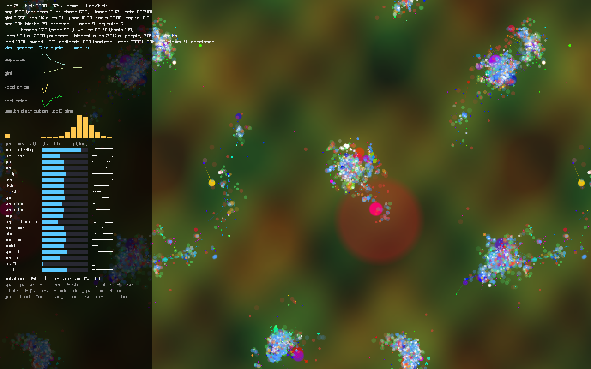
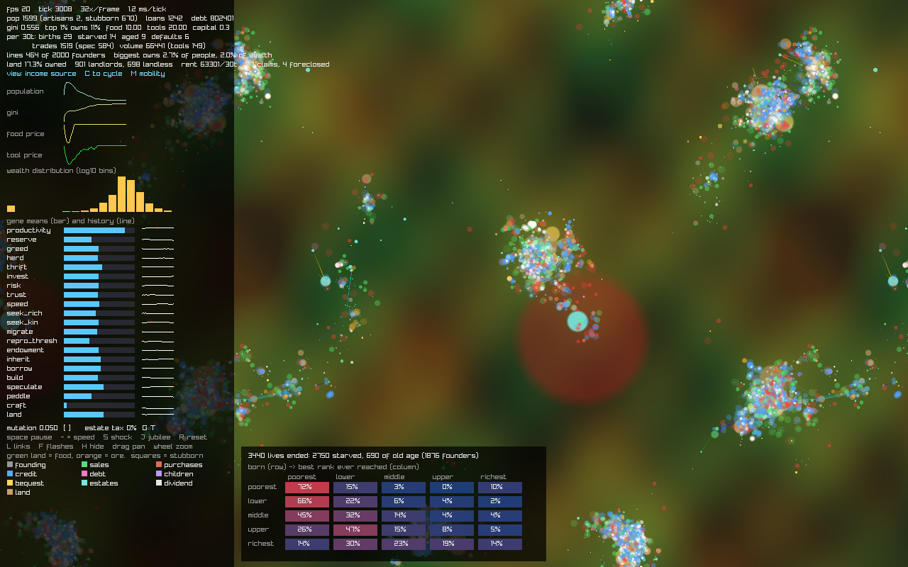
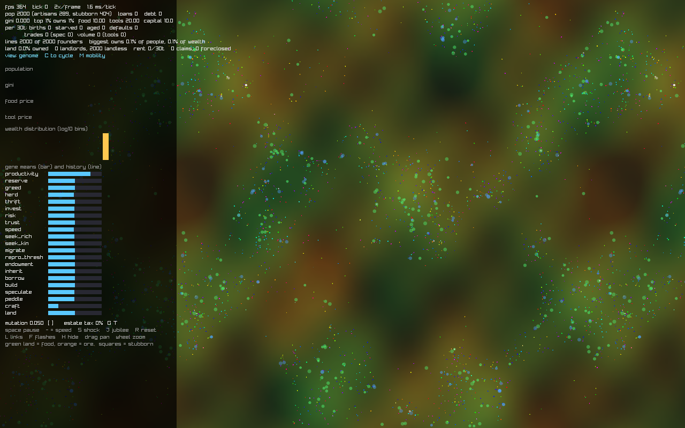
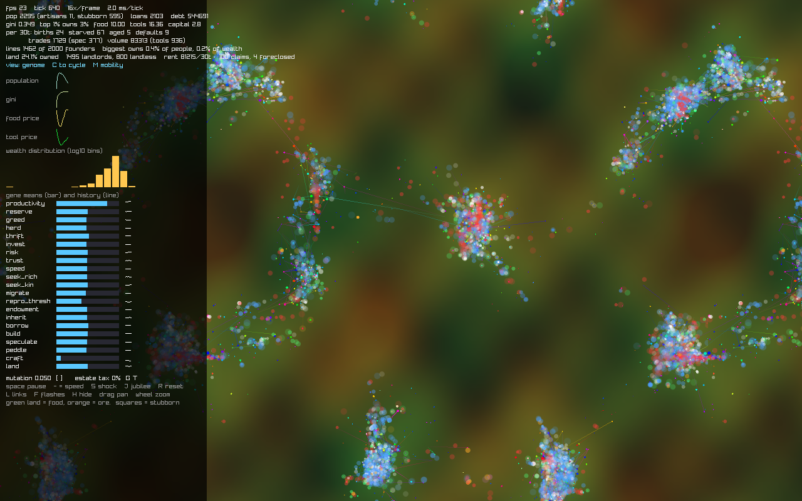
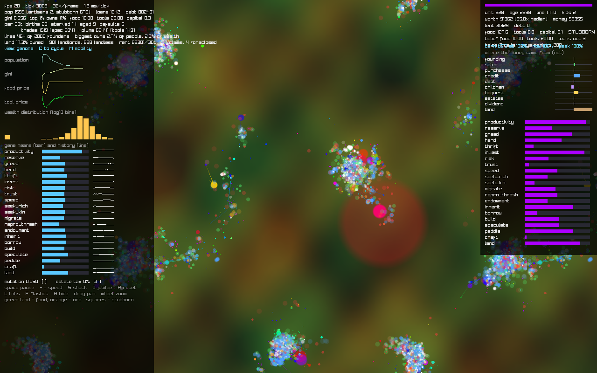
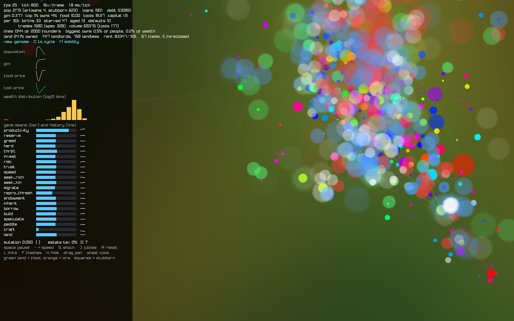
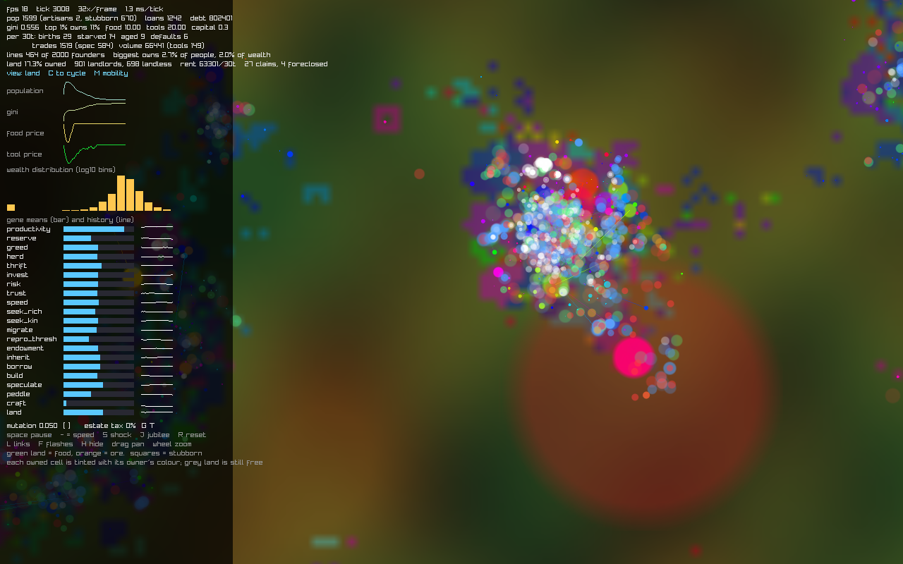
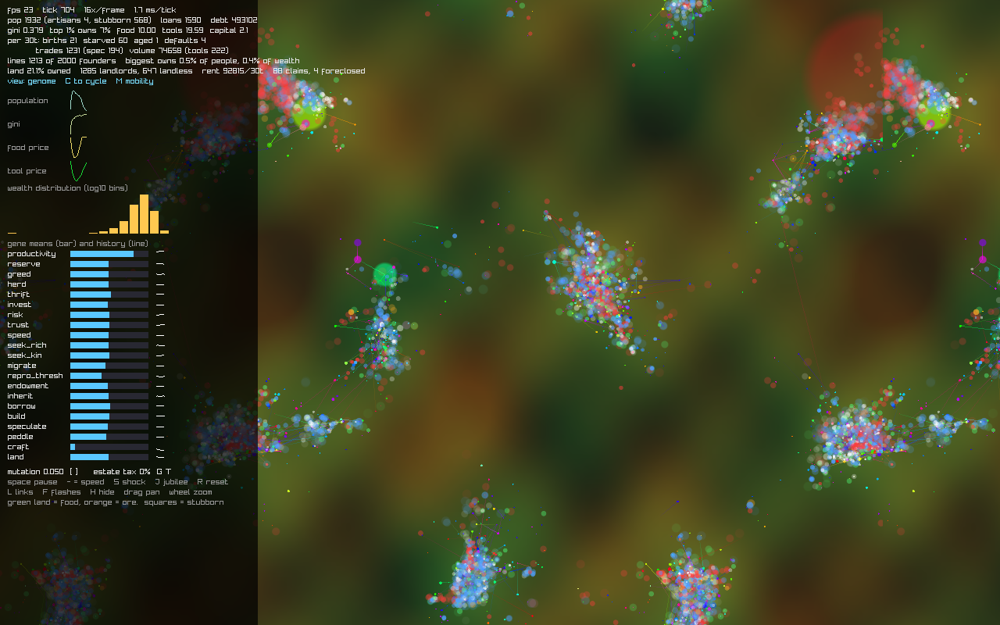
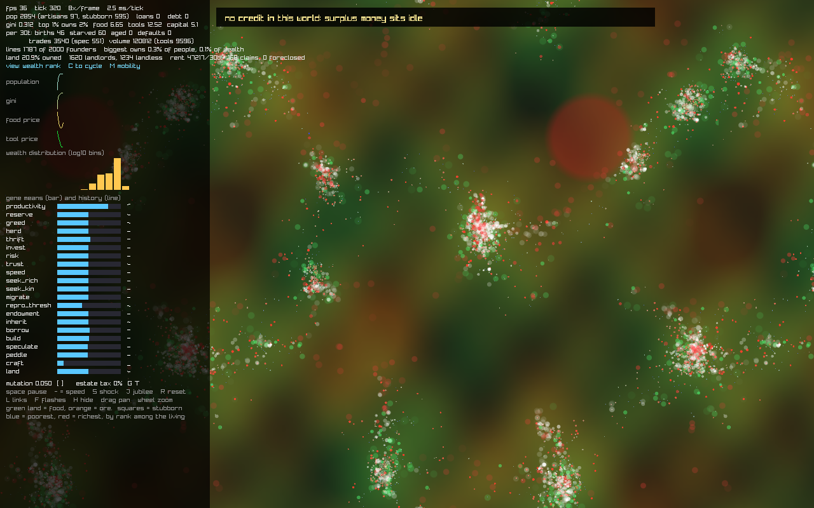

# capitalism

An agent-based economy that you watch rather than read about. Units farm, mine, haggle, lend, go
broke, inherit and breed on a wrap-around world, and every behaviour they have is a number in a
genome that mutates at birth. Nobody is told how to act — prices, towns, trade routes, credit
bubbles and inequality are what is left after the selection pressure runs for a few thousand ticks.

Every coin is tagged with where it came from, so the simulation can answer the question it exists to
ask: **how does someone win at capitalism, and how does someone lose?** Run a scenario over a dozen
seeds and it will tell you, with confidence intervals — see [Asking a question](#asking-a-question).

The world is sized at startup. The default is 2,000 units on 2048×2048; `--cap`/`--grid` scale that
to a continent — a quarter of a million units on 16384×16384 has been run to steady state with every
invariant intact. See [Scale](#scale).

LuaJIT + raylib, ~3,000 lines, no dependencies beyond the raylib shared library.



## Run it

```sh
brew install luajit raylib     # macOS; any LuaJIT 2.1 + raylib 5/6 works
luajit main.lua                # opens the window
luajit run.lua --scenario=scenarios/credit.lua   # headless: an experiment, with statistics
luajit check.lua               # headless: 5000 ticks, asserts every invariant, prints ticks/sec
luajit bench.lua               # headless throughput, best of N passes, no assertions
```

`main.lua` refuses to open a window until every raylib symbol resolves, the C struct layouts match,
and the simulation reproduces a known fingerprint from a fixed seed. If it starts, it is correct-ish.

## What you are looking at

**The land** is a static two-resource map. Green is fertility (food per unit of labour), orange is
ore (tools). They mostly do not overlap, which is the central tension of the whole model: the people
who can make tools do not live where the food is.

**The world wraps** — it is a torus, with no edge and no corner, and the fertility field is periodic
so it tiles seamlessly. The view draws every copy of the world the camera can see, so panning never
runs out of map and a town sitting on the seam is drawn as one town rather than two halves.

**Each dot is one person.** Its colour is a fixed projection of its 21-gene genome onto a hue, so
similar colours mean similar strategies and a spreading colour is a strategy winning. Its radius is
net worth relative to the median (money + loans out − debt + goods and capital at market prices),
deliberately exaggerated so a 10× fortune is impossible to miss. Squares are the *stubborn* class:
frozen genome, frozen price beliefs, no drives. They are the control group, and the fact that they
are still ~40% of the population at tick 3,000 is the point: adaptation buys less than you would think.

**`C` cycles what the colour means.** The genome projection above is one of five views:

| View | Colour |
|---|---|
| `genome` | the fixed hue projection — similar colours are similar strategies |
| `wealth rank` | blue is the poorest of the living, red the richest |
| `dynasty` | one colour per founding line; a colour spreading is a lineage winning |
| `income source` | the channel this unit has taken the most money from, so far, in its life |
| `land` | tints each owned cell with its owner's colour, so you watch the map get enclosed |

**Lines are loans**, drawn from lender to borrower, brightness in proportion to the amount owed.
**Flashes** mark events: white = trade, green = birth, red = death, orange = default, blue = a loan
written. A translucent red disc is a crop failure (a regional shock), which is the only way food is
destroyed other than eating and spoilage.

### The panel

| Row | Meaning |
|---|---|
| `fps / tick / 16×frame / ms per tick` | render rate, simulation age, ticks run per frame, cost of a tick |
| `pop (artisans, stubborn)` | living units; artisans are tool-makers, stubborn are the frozen class |
| `gini / top 1% owns` | inequality. Gini is 0 when everyone is equal, 1 when one person owns everything |
| `food / tools / capital` | median transaction prices, and mean installed capital per head |
| `per 30t:` | births, starvations, old-age deaths and loan defaults in the last 30 ticks |
| `lines` | founding lines with anyone left alive, and what the largest one owns |
| `land` | share of cells owned, landlords against landless, rent flow, claims and foreclosures |
| sparklines | population, Gini, food price and tool price over the last 240 samples |
| wealth distribution | histogram of net worth in log₁₀ buckets — watch the right tail grow |
| gene means | population-average of each gene (bar) and its history (line) |

Click anyone to open the inspector on the right: their money, stock, debts, price beliefs, full
genome, the rank they were born into against the rank they hold now — and **where their money came
from**, one bar per channel, right for money taken in and left for money paid out.

`M` opens the mobility table: of everyone who has died, the fraction born into each fifth of the
wealth order that ever reached each fifth. It is the plainest statement of how much birth decides.



## The states to watch for

Each caption is the command that produced the image, so you can re-run any of them.

### Founding — 2,000 strangers, no trades yet

`luajit main.lua --seed=7 --speed=2 --shot=8`



2,000 founders with equal money, 300 food and a random age, dropped onto land that is at least
decent (fertility > 0.55, or ore for the 15% who start as artisans). Genes are uniform random apart
from productivity and craft, which are biased so the first generation is not 95% stillborn. Gini is
0.000 and the prices on screen are beliefs, not trades: nothing has been sold yet.

### Growth — towns condense on the good land

`luajit main.lua --seed=7 --speed=16 --shot=40`



By tick ~600 the map has emptied except for a dozen dense settlements sitting on fertility peaks,
linked by loan lines. Population is up, Gini has gone from 0.000 to 0.32, and the sparklines show
food price diving as the first harvests hit the market and then recovering to about 10. 2,160 loans
are outstanding. The red disc top-centre is a crop failure in progress.

### Maturity — a stable, unequal economy

`luajit main.lua --seed=7 --speed=32 --shot=94`


At tick ~3000 population and prices have flattened out, with Gini at 0.557 and the top 1% holding
11%. 17.3% of the map is owned, by 902 landlords against 695 landless; 467 of the 2,000 founding
lines still have a descendant alive. The wealth histogram is a long right tail and births roughly
balance deaths. Note `artisans 1`: the tool sector has quietly died, which is the big open problem
(see [`PLAN.md`](PLAN.md)).

### Inspector — one person's whole life

`luajit main.lua --seed=7 --speed=32 --shot=94 --pick`



`--pick` selects the richest unit for the screenshot. This one is worth 6× the median, is 3,164 ticks
old, holds 139 food and no tools, and its genome says why: high productivity, high risk, high
speculation, near-zero thrift and craft. It is a farmer-speculator that never touched the tool trade.

### Close up — individuals and credit

`luajit main.lua --seed=7 --speed=16 --shot=50 --zoom=6`



Zoomed into a single town. Big translucent circles are the rich, pinpricks are the poor, and the
threads between them are outstanding loans. The colour mixing shows several genomes coexisting in
the same market rather than one lineage sweeping.

### Enclosure — the map being taken

`luajit main.lua --seed=7 --speed=32 --shot=94 --view=4 --zoom=2`



The `land` view tints every owned cell with its owner's colour; grey-green land is still free. At
tick 3,000, 17.3% of the map is owned by 902 landlords, and 695 units own nothing at all. Note the
isolated claimed cells scattered out into empty country, well away from the town — those are
speculators, who claim the best cell within reach rather than the one they stand on, so land gets
enclosed before anyone arrives to work it.

### Crop failure — the shock channel

`luajit main.lua --seed=7 --speed=16 --shot=45 --shock-every=25`



Inside the red disc, fertility drops to 15% for as long as the shock lasts. Red death flashes cluster
inside it, starvations and defaults tick up, and the survivors walk out along the food-supply
gradient. Press `S` to drop one wherever the mouse is; `--shock-every=0` turns them off entirely.

## Asking a question

A scenario is a Lua table: knobs, a set of arms to compare, and events that fire on an exact tick.
`scenarios/credit.lua` in full:

```lua
return {
  name = "credit",
  about = "Ablate lending. If fortunes are built on interest, an economy with no credit should ...",
  ticks = 4000,
  arms = {
    { name = "credit" },
    { name = "no-credit", knobs = { lending = 0 } },
    { name = "rate-capped", knobs = { usury = 0.08 } },
  },
  events = {
    { at = 1, arm = "no-credit", say = "no credit in this world: surplus money sits idle" },
    { at = 2500, say = "compare the credit and debt rows of the death table" },
  },
}
```

Events carry `set` (change a knob), `shock` (a crop failure), `jubilee` (forgive every debt where it
stands) and `say` (a caption on screen). The same file plays out in the window or runs headless:

```sh
luajit main.lua --scenario=scenarios/credit.lua --arm=no-credit   # watch one arm, with captions
luajit run.lua  --scenario=scenarios/credit.lua --seeds=8         # run every arm, 8 seeds each
make credit SEEDS=20                                              # same, one target per scenario
make scenarios                                                    # all of them
```

The ones in the box: `credit` (ablate lending, cap the interest rate), `enclosure` (can land be
owned, and at what rent), `estate-tax` (tax estates into a flat dividend), `jubilee` (cancel all
debt, once or repeatedly) and `famine` (a settled economy, then relentless crop failure).



**Every arm sees the same seeds**, so `run.lua` reports the *paired* difference — the same world
twice, one knob apart — which is far tighter than comparing two independent means. A single run
proves nothing here: the trajectory is chaotic, and any intervention shifts the random stream.

```
metric                    credit         no-credit       rate-capped
gini                0.3477 +-0.0093     0.2995 +-0.0148     0.3294 +-0.00919

paired difference vs 'credit' (same seed both sides; * = 95% CI excludes zero)
gini              -0.04821 +-0.0182*    -0.01835 +-0.0181*
top1              -0.01211 +-0.00648*   -0.007999 +-0.00591*
tot_volume        -5.264e+05 +-2.6e+06   -1.338e+06 +-2.01e+06
```

Then, per arm, every life that ended: the mobility table, and the mean lifetime money flow by
channel for each fifth of the wealth order.

`--csv=` writes one row per run, `--deaths=` one row per death (birth tick, lifespan, dynasty, cause,
rank born into, best rank reached, children, and all nine channels), for whatever you want to plot.

### What it says so far

On the default world, 4,000 ticks, 10 seeds per arm, paired on seed.

**Owning land is how you win.** Turn enclosure on and Gini goes 0.348 → 0.594 (+0.246 ± 0.015) and
the top 1% share more than doubles, 0.047 → 0.113 (+0.067 ± 0.011). Net lifetime money from land, by
the best fifth a unit ever reached:

```
peak fifth     poorest    lower   middle    upper  richest
land              -182     -611    -1102    -1181    +1048
```

The bottom four fifths pay rent; only the top fifth collects it. For the middle fifth, land is a
lifetime drain of 1,102 against total sales income of 856 — rent costs them more than they earn by
selling.

**It shrinks the population by a third, through fertility rather than famine.** Births fall 1,742 ±
236 while starvations fall 1,141 ± 194 *in absolute terms*. Nobody is being starved out by rent;
they are being kept too poor to afford a child's stake. Trade volume halves, so the economy produces
and exchanges much less. Defaults rise 71% and total debt by two thirds — rent pushes tenants into
credit they cannot service.

**A 60% estate tax does almost nothing to it** (Gini +0.230 against +0.246). Land passes to the heir
whole, unsplit and untaxed, so taxing money estates leaves the thing that actually compounds
untouched. Cutting the rent rate to 5% *does* work (+0.041 ± 0.016), which is the dose-response you
would want before believing any of this.

**Land changed what credit is for.** Measured again with land in the world, abolishing lending still
cuts Gini (−0.064 ± 0.020) but **no longer measurably dents the top 1%** (−0.006 ± 0.010, the
interval straddles zero). The channel tables say why — for the richest fifth:

| | commons | enclosed |
|---|---|---|
| `credit` | +48 | **−179** |
| `land` | 0 | **+1048** |

Where land cannot be owned, the top fifth makes a small profit lending. Where it can, the top fifth
*loses* money on credit and collects rent instead. The earlier finding here — "lending is how you
win" — was true only of a world with no landlords in it, which is a good argument for re-running
every claim after every model change.

**Birth decides most of it, more so once land exists.** 71% of those born into the poorest fifth
never leave it, and only 7% ever reach the top (against 5% before enclosure); 22% of those born
richest die there. Estates of dead neighbours remain the second-largest inflow to the rich (`105 …
1545` by quintile) and still dwarf named inheritance (`5 … 145`), because estates scatter to whoever
is standing nearby and the rich stand in crowded towns.

Each of those is a claim the code will argue with you about, which is the point.

## Controls

| Key | Action |
| --- | --- |
| `space` | pause |
| `-` / `=` | halve / double ticks per frame |
| `C` | cycle the colour view (genome / wealth rank / dynasty / income source / land) |
| `M` | mobility table |
| `S` | crop failure at the mouse |
| `J` | jubilee: forgive every outstanding debt |
| `R` | reset with the next seed |
| `L` / `F` | toggle loan links / event flashes |
| `H` | hide the panels |
| `[` / `]` | mutation σ down / up |
| `G` / `T` | estate tax down / up (share of every estate paid into a flat dividend) |
| drag / wheel | pan / zoom |
| click | select a unit |

## Flags

Both binaries take the same world knobs; `--help` prints them with defaults.

```
--cap --grid --cell --compact-every                      world size and memory layout
--pop --money --artisans --yield --toolrate --mut        economy
--estate-tax --lending --usury --shock-every             policy
--enclosure --rent --land-price --max-holding            land
--stubborn-founders --stubborn-birth --track
```

`--enclosure=0` is a world where land cannot be owned at all; above zero it scales how readily
unowned cells are claimed. `--rent` is the share of a cell's yield its owner collects from whoever
works it, `--land-price` the cash a claim costs, and `--max-holding` the ceiling on cells per unit.
That last one is not a neutral implementation detail: **the top holders sit on whatever cap you set**,
and Gini lands at 0.563 / 0.606 / 0.636 for caps of 8 / 16 / 32. Nothing in the model stops one unit
owning the world except that number, so it is a knob rather than a constant.

Ownership costs one `int32` per cell plus `2 × max_holding × 4` bytes per unit slot (1MB on the
default world, 33MB at continental cap) and is within noise of free on the tick. `--enclosure=0`
allocates none of it.

`--lending` scales how often surplus money is offered as a loan (`0` is an economy with no credit)
and `--usury` caps the interest rate; both are the levers the `credit` scenario pulls. `--track=0`
turns off the per-unit ledger, rank history and death records — it costs 96 bytes per unit slot and
about 1.5% of the tick at the default size, 4% at 130k units, and without it the inspector's channel
bars, the mobility table and the death tables are all empty.

`--cap` is the hard population ceiling (a power of two), `--grid` the cells per side (a power of
two), `--cell` the cell size in world units — which is also the interaction radius. The world is
`grid × cell` across, so `--grid=1024` is a 16384×16384 map. Everything is allocated from these at
`init()`, so memory is fixed from the moment it returns: about 750 bytes per unit slot plus 40
bytes per cell — 427MB measured for `--cap=524288 --grid=1024`.

`main.lua` adds `--seed --speed --shot --width --height --zoom --pick --view --mob --scenario --arm
--no-selftest`. `check.lua` adds `--ticks --seed --fast`. `bench.lua` adds `--ticks --warm --passes
--seed` and defaults `--track=0`, since it measures the tick rather than the reporting.
`run.lua` adds `--scenario --arm --seeds --seed0 --ticks --csv --deaths --quiet`.
Unknown flags, non-numbers and out-of-range values exit 2.

## How a tick works

0. **Grid** — counting sort of the live set into `cell` × `cell` buckets, so neighbour lookups are
   O(1). Every `--compact-every` ticks the units are then renumbered into that cell order and every
   reference to them (loans, heirs, the live list, the UI selection) is remapped, so the per-unit
   gathers that follow walk memory forwards instead of jumping around an array far larger than cache.
   Slot identity carries no economic state, so this changes nothing but the addresses.
2. **Produce** — food and tools from the local field × labour × capital, divided by crowding.
   Splitting effort between the two is penalised (squared shares), so specialising pays. If someone
   else owns the cell, a `rent` share of what it yields goes to them at the going market price.
3. **Scan** — each unit looks at its cell neighbourhood once: who is selling, who is rich, who is kin.
4. **Trade** — two markets, food and tools. Buyers pay up to their belief-driven willingness to pay,
   sellers ask their reference price plus greed. Both sides update their beliefs from what happened.
5. **Lend** — surplus money becomes a fixed-term loan; the borrower converts it to capital, which
   multiplies labour and depreciates 0.3% per tick. Death or strategic default leaves the lender short,
   and takes one of the borrower's cells in lieu.
6. **Claim** — a unit with cash to spare buys an unowned cell from the commons. Speculators claim the
   best cell within reach rather than the one under their feet, so land is enclosed ahead of settlement.
7. **Move** — hunger climbs the food-supply field, cargo climbs the demand field, and ambition climbs
   the yield-per-head field. Movement is paid for by distance actually travelled.
8. **Birth** — enough money, enough food banked and not too crowded: a child is placed by a greedy
   climb of the opportunity field, with a mutated genome and a stake out of the parent's pocket.
9. **Settle** — loan instalments, deaths, estates (creditors, then heirs, then neighbours), dividend.
   Land passes whole to the heir, unsplit and untaxed.

**Money is closed and exact.** It is stored as integer-valued doubles and every transfer is floored,
so `sum(money) + sum(escrow)` is the same number on tick 1 and tick 100,000. Only food and tools are
created and destroyed. That invariant is what `check.lua` exists to defend.

**Every transfer is also tagged.** With `--track` on, each unit carries nine signed counters — one
per way money can reach it or leave it — and they are exhaustive by construction, so a unit's
channels sum to *exactly* the money it holds. `validate()` checks that equality for every unit, which
means a transfer that forgot to record itself is a hard failure rather than a quietly wrong table.
Seven of the nine are gross flows; `credit` and `debt` are netted within themselves, so `credit` is
lifetime profit from lending and `debt` is the lifetime cost of borrowing (positive if you defaulted
and kept it).

## Scale

Everything is a flat FFI array sized at `init()`, so the only ceiling is memory. Measured on an
M-series laptop, LuaJIT 2.1, single-threaded, assertions off (`bench.lua`, best of 3 passes):

| world | cap | steady-state pop | ms/tick | ticks/s | unit-ticks/s |
|---|---|---|---|---|---|
| 2048² (default) | 16,384 | ~2,000 | 1.4 | 729 | 1.64M |
| 8192² | 262,144 | ~126,000 | 114 | 8.8 | 1.16M |
| 16384² | 524,288 | ~276,000 | 236 | 4.2 | 1.04M |

Cost per unit depends on how clustered the population is, not just its size: a freshly seeded
16384² world ticks in ~40ms because everyone is spread thin, and slows as towns condense and each
unit acquires neighbours. The table is steady state, which is the pessimistic end.

```sh
luajit bench.lua --cap=524288 --grid=1024 --pop=200000 --ticks=25
luajit main.lua  --cap=262144 --grid=512  --pop=100000     # watchable
```

A continent runs, but it runs at a few ticks per second, not at 60. The largest single cost is
still neighbour discovery, and it is memory-latency bound rather than compute bound: the profiler
reports ~94% of the tick executing compiled traces with no aborts, so there is no interpreter
overhead left to reclaim, and the wins have all come from moving bytes closer together.

Things that were tried and **lost**, so they are not in the code:

- Splitting the six field propagations into one pass each. They share their index arithmetic; six
  passes cost six times as much.
- Holding the scan accumulators in registers per unit instead of read-modify-writing `SC`. The inner
  loop is only ~7 iterations, and trace-entry overhead ate the saving.
- Rejecting out-of-range candidates in the consumer instead of the producer. It moves the work, it
  does not remove it.
- **Verlet lists** — caching the neighbour list across ticks with a skin radius, the standard trick
  from molecular dynamics. Measured first: units drift 1.06 world units per tick on average and up
  to 5 at the tail, against an interaction radius of 16. The fastest cover ~31% of the cutoff every
  tick, so a conservative skin has to be about 10 — and a cached list of radius 26 covers π·26² =
  2124 units² against the grid's 9·16² = 2304. The same size. You would pay an identical per-tick
  distance test *plus* a periodic rebuild over a 5×5 block. Verlet pays in MD because particles move
  ~1% of the cutoff per step; here it is 31%.
- **R-trees or another spatial index.** A uniform grid with cell size = query radius is already O(1)
  expected candidates via pure arithmetic; a tree adds an O(log n) descent of *dependent* pointer
  loads, which is the exact access pattern everything above was built to avoid. It would also have
  to be rebuilt every tick — bulk-loading is a sort, strictly worse than the O(n) counting sort the
  grid uses. Trees earn their keep for extended objects, varying query radii, or disk-resident data;
  these are points, one fixed radius, all in RAM.

What would actually move the needle next is threads — the tick decomposes cleanly by cell — and
LuaJIT has no shared-memory parallel loop. That is the argument for a C kernel, not the language.

## Genes

Each gene has a cost, or it would simply evolve to 1.0 and the simulation would be boring.

| Gene | Effect |
|---|---|
| `productivity` | output per tick — costs upkeep |
| `craft` | share of labour spent on tools rather than food |
| `reserve` | buffer kept back before selling or lending |
| `greed` | markup over reference price — fewer sales, more spoilage |
| `herd` | weight on neighbours' prices — follows bubbles |
| `thrift` | willingness to pay when hungry — starves if too low |
| `invest` / `risk` | share of surplus lent out, and tolerance for bad borrowers |
| `borrow` | appetite for debt |
| `trust` | repay versus strategically default — defaulters get refused locally |
| `build` | converts money into capital |
| `speculate` | buys to resell rather than to consume |
| `peddle` | carries cargo toward demand |
| `land` | appetite for claiming cells — the cash spent is not producing anything |
| `speed` / `seek_rich` / `seek_kin` / `migrate` | movement drives |
| `repro_thresh` / `endowment` / `inherit` | when to breed, the child's stake, how the estate splits |

## Development

```sh
make run      # windowed
make check    # headless audit
make lint     # luacheck
make fmt      # stylua
make ci       # fmt-check + lint + check
make bench    # throughput, default world
make bench-big # throughput, 16384x16384 continent
make shots    # regenerate docs/*.png
make scenarios # every scenario, 8 seeds per arm
make credit SEEDS=20   # one scenario; there is a target per scenarios/*.lua
```

Formatting is [StyLua](https://github.com/JohnnyMorganz/StyLua) with `.stylua.toml`
(220 columns, 2-space indent, one-line statements preserved); `make fmt-check` fails on unformatted
code. Linting is [luacheck](https://github.com/lunarmodules/luacheck) with `.luacheckrc`
(`std = "luajit"`, so `ffi`, `bit` and `jit` are known globals). Both come from Homebrew:
`brew install stylua luacheck`. The tree is warning-free; keep it that way.

The simulation asserts aggressively, in four tiers, so a production run pays for none of them:

| tier | runs | cost |
|---|---|---|
| static checks on constants and struct layout | once per `init()` | free |
| per-phase conservation checks | only when `sim.debug` is true | 1.1× |
| `sim.validate()` — every unit, loan, free-list and money channel reconciled | only when called | O(cap) |
| `sim.selftest()` — same seed twice, fingerprints compared | `main.lua` startup unless `--no-selftest` | fixed, always on the default small world |

There are no assertions inside any per-unit loop; the `if dbg then` branches sit once per phase.
`check.lua` turns all of it on (`--fast` turns the per-phase tier off); `bench.lua` and `main.lua`
leave it off. `validate()` uses FFI scratch rather than Lua tables so the full audit still runs at
continental cap.

[`PLAN.md`](PLAN.md) has the design rationale, the performance traps (LuaJIT trace aborts, raylib
struct-by-value FFI calls), the bugs the assertions caught, and what is still broken — chiefly that
the tool sector does not sustain itself, because ore and farmland are too far apart for a 30-tick
food buffer.

## License

MIT
